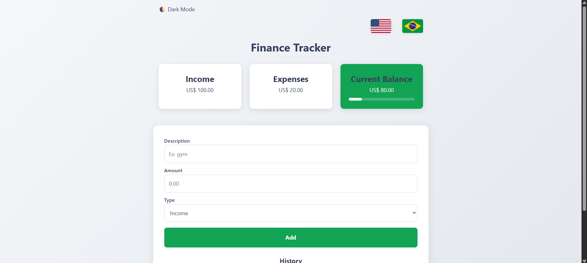
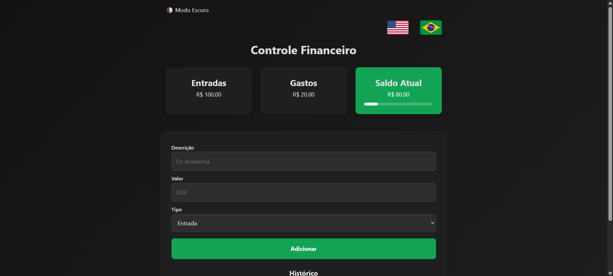

# 💰 Finance Tracker 2026

A modern, intuitive, and high-performance personal finance application. This tool allows users to manage their daily transactions with real-time feedback, featuring a bilingual interface and a persistent dark mode experience.

## 🚀 Key Features

- **Transaction Management:** Easily add and delete income or expense entries.
- **Persistent Dark Mode:** A seamless theme switcher that remembers user preference across sessions.
- **Internationalization (i18n):** Full support for English (US$) and Portuguese (R$), including localized date formatting.
- **Dynamic Progress Bar:** Visual budget tracking that monitors expense ratios relative to total income.
- **Data Persistence:** Utilizes browser LocalStorage to ensure data is never lost on refresh.
- **Responsive Architecture:** Fully optimized for a mobile-first experience using modern CSS Flexbox.

## 🛠️ Tech Stack

- **HTML5** & **CSS3** (Flexbox/Custom Properties)
- **JavaScript** (ES6+ & LocalStorage)
- **Git** (Version Control)

## ♿ Accessibility Focused (a11y)

In this project, a core focus was placed on making financial management inclusive for everyone:
- **Semantic HTML:** Used proper document structure (tags like `<main>`, `<section>`, and `<label>`) to ensure screen readers can navigate effectively.
- **Dynamic ARIA Labels:** Implementation of `aria-live="polite"` on the total balance to notify assistive technologies of value changes without interrupting the user.
- **Inclusive UI:** Every interactive icon (like the delete button or theme switcher) includes descriptive `title` and `aria-label` attributes that translate dynamically with the selected language.
- **Contrast & Visibility:** Color palettes were chosen to maintain high contrast ratios in both Light and Dark modes.

## 🧠 Technical Learnings

Developing this v1.0 version provided deep insights into:
1. **Advanced DOM Manipulation:** Dynamically updating UI components based on complex financial logic.
2. **State Management:** Handling local data arrays and keeping them synchronized with the UI and LocalStorage.
3. **CSS Architecture:** Utilizing CSS Variables (Custom Properties) to create a robust, scalable theme system.
4. **I18n Logic:** Implementing a custom translation engine that preserves icons and accessibility metadata.

## 🔗 Live Demo
Check out the live application here: [https://devraph12.github.io/finance-tracker-2026/]

